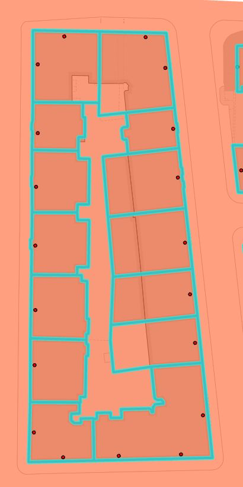
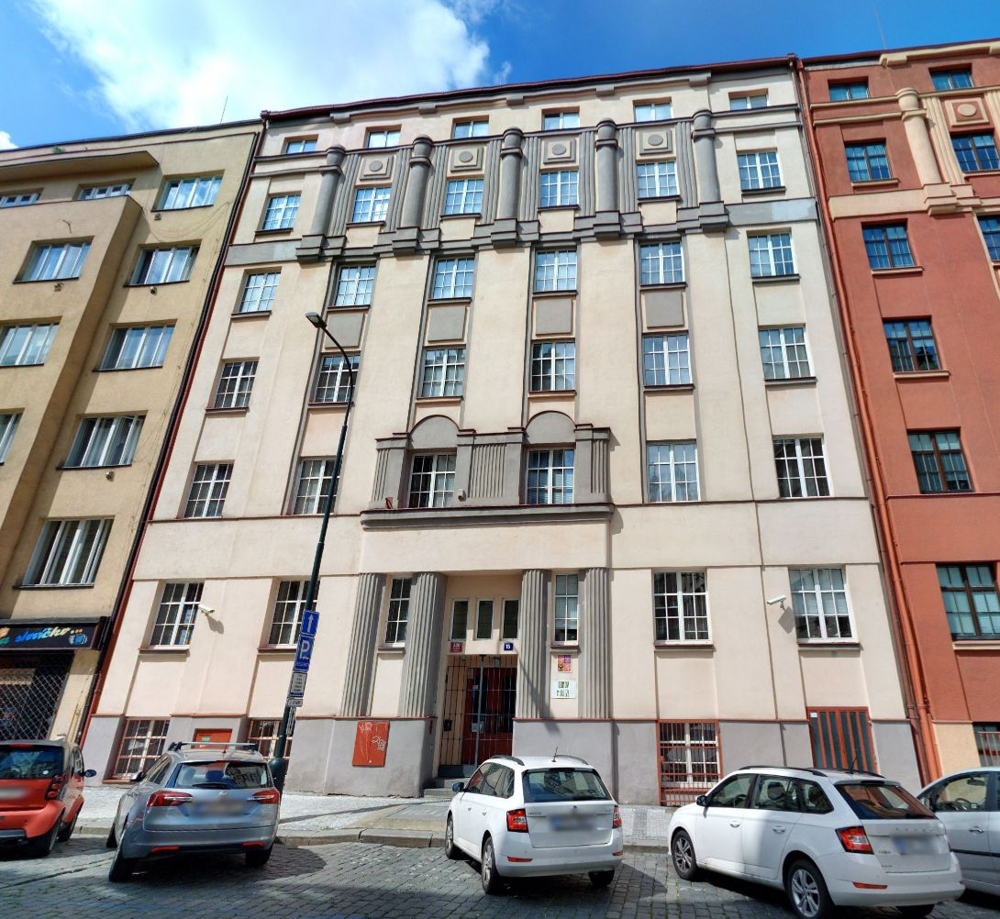
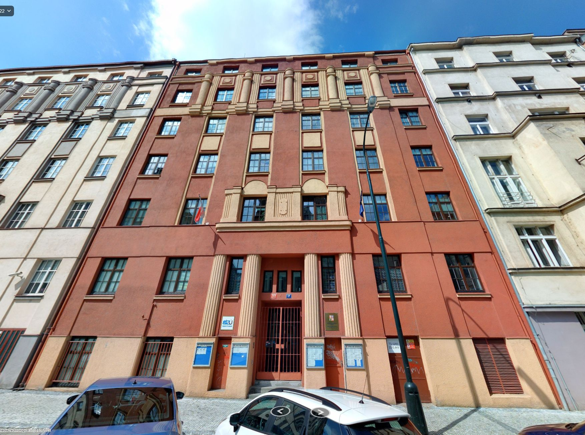
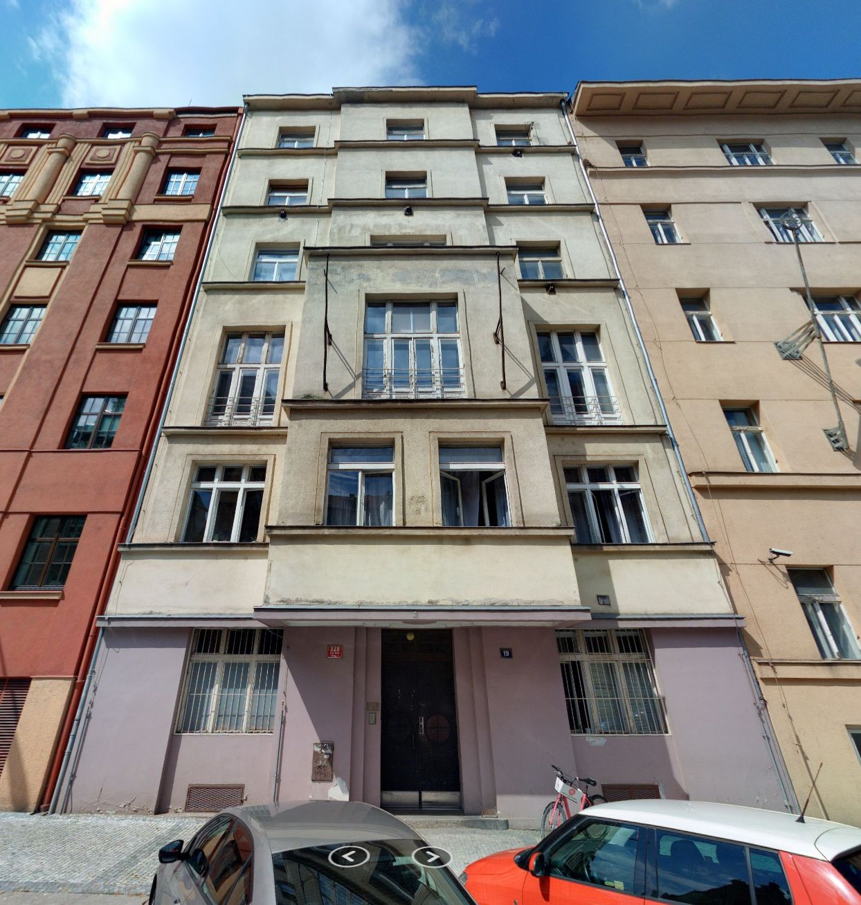

---
hide:
  - navigation
  - toc
---

## Významné budovy {align=center}

-   {.no-filter}

    __Arcibiskupský palác__
    {align=center}

    [:custom-mapycz-logo:{.xl}](https://mapy.cz/zakladni?source=base&id=1701166){.map target="_blank" title="Mapy.cz"}&nbsp;&nbsp;&nbsp;
    [:custom-trimbleconnect-logo:{.xl}](https://web.connect.trimble.com/projects/bJi_P-MVv0w/data/folder/bjzjf7-eP_E){.trimble target="_blank" title="Trimble Connect"}&nbsp;&nbsp;&nbsp;
    [:custom-agsceneviewer-logo:{.xl}](#){.agol target="_blank" title="ArcGIS Online"}
    {align=center .links}

-   {.no-filter}

    __Palác Žofín__
    {align=center}

    [:custom-mapycz-logo:{.xl}](https://mapy.cz/zakladni?source=base&id=2083096){.map target="_blank" title="Mapy.cz"}&nbsp;&nbsp;&nbsp;
    [:custom-trimbleconnect-logo:{.xl}](https://web.connect.trimble.com/projects/bJi_P-MVv0w/data/folder/9sH-wvEU0u4){.trimble target="_blank" title="Trimble Connect"}&nbsp;&nbsp;&nbsp;
    [:custom-agsceneviewer-logo:{.xl}](#){.agol target="_blank" title="ArcGIS Online"}
    {align=center .links}

-   {.no-filter}

    __Palác Kinských__
    {align=center}

    [:custom-mapycz-logo:{.xl}](https://mapy.cz/zakladni?source=base&id=1915825){.map target="_blank" title="Mapy.cz"}&nbsp;&nbsp;&nbsp;
    [:custom-trimbleconnect-logo:{.xl}](https://web.connect.trimble.com/projects/bJi_P-MVv0w/data/folder/A-VzovJq2AQ){.trimble target="_blank" title="Trimble Connect"}&nbsp;&nbsp;&nbsp;
    [:custom-agsceneviewer-logo:{.xl}](#){.agol target="_blank" title="ArcGIS Online"}
    {align=center .links}

-   {.no-filter}

    __Ministerstvo průmyslu a obchodu__
    {align=center}

    [:custom-mapycz-logo:{.xl}](https://mapy.cz/zakladni?source=base&id=2196589){.map target="_blank" title="Mapy.cz"}&nbsp;&nbsp;&nbsp;
    [:custom-trimbleconnect-logo:{.xl}](https://web.connect.trimble.com/projects/bJi_P-MVv0w/data/folder/0gKY7IwmpVM){.trimble target="_blank" title="Trimble Connect"}&nbsp;&nbsp;&nbsp;
    [:custom-agsceneviewer-logo:{.xl}](#){.agol target="_blank" title="ArcGIS Online"}
    {align=center .links}

-   {.no-filter}

    __Schwarzenberský palác__
    {align=center}

    [:custom-mapycz-logo:{.xl}](https://mapy.cz/zakladni?source=base&id=1916007){.map target="_blank" title="Mapy.cz"}&nbsp;&nbsp;&nbsp;
    [:custom-trimbleconnect-logo:{.xl}](https://web.connect.trimble.com/projects/bJi_P-MVv0w/data/folder/Woe0L72dOFA){.trimble target="_blank" title="Trimble Connect"}&nbsp;&nbsp;&nbsp;
    [:custom-agsceneviewer-logo:{.xl}](#){.agol target="_blank" title="ArcGIS Online"}
    {align=center .links}

-   {.no-filter}

    __Strakova akademie__
    {align=center}

    [:custom-mapycz-logo:{.xl}](https://mapy.cz/zakladni?source=base&id=33847){.map target="_blank" title="Mapy.cz"}&nbsp;&nbsp;&nbsp;
    [:custom-trimbleconnect-logo:{.xl}](https://web.connect.trimble.com/projects/bJi_P-MVv0w/data/folder/mY4DxiU3cBc){.trimble target="_blank" title="Trimble Connect"}&nbsp;&nbsp;&nbsp;
    [:custom-agsceneviewer-logo:{.xl}](#){.agol target="_blank" title="ArcGIS Online"}
    {align=center .links}

-   {.no-filter}

    __Anežský klášter__
    {align=center}

    [:custom-mapycz-logo:{.xl}](https://mapy.cz/zakladni?source=base&id=1890441){.map target="_blank" title="Mapy.cz"}&nbsp;&nbsp;&nbsp;
    [:custom-trimbleconnect-logo:{.xl}](https://web.connect.trimble.com/projects/bJi_P-MVv0w/data/folder/6Z6J4u--zdg){.trimble target="_blank" title="Trimble Connect"}&nbsp;&nbsp;&nbsp;
    [:custom-agsceneviewer-logo:{.xl}](#){.agol target="_blank" title="ArcGIS Online"}
    {align=center .links}

-   {.no-filter}

    __Valdštejnský palác__
    {align=center}

    [:custom-mapycz-logo:{.xl}](https://mapy.cz/zakladni?source=base&id=1833588){.map target="_blank" title="Mapy.cz"}&nbsp;&nbsp;&nbsp;
    [:custom-trimbleconnect-logo:{.xl}](https://web.connect.trimble.com/projects/bJi_P-MVv0w/data/folder/LzaT6VgECCo){.trimble target="_blank" title="Trimble Connect"}&nbsp;&nbsp;&nbsp;
    [:custom-agsceneviewer-logo:{.xl}](#){.agol target="_blank" title="ArcGIS Online"}
    {align=center .links}

-   {.no-filter}

    __Betlémská kaple__
    {align=center}

    [:custom-mapycz-logo:{.xl}](https://mapy.cz/zakladni?source=base&id=1898914){.map target="_blank" title="Mapy.cz"}&nbsp;&nbsp;&nbsp;
    [:custom-trimbleconnect-logo:{.xl}](https://web.connect.trimble.com/projects/bJi_P-MVv0w/data/folder/_VO5MvG_1Xk){.trimble target="_blank" title="Trimble Connect"}&nbsp;&nbsp;&nbsp;
    [:custom-agsceneviewer-logo:{.xl}](#){.agol target="_blank" title="ArcGIS Online"}
    {align=center .links}

-   {.no-filter}

    __Šternberský palác__
    {align=center}

    [:custom-mapycz-logo:{.xl}](https://mapy.cz/zakladni?source=base&id=1836635){.map target="_blank" title="Mapy.cz"}&nbsp;&nbsp;&nbsp;
    [:custom-trimbleconnect-logo:{.xl}](https://web.connect.trimble.com/projects/bJi_P-MVv0w/data/folder/kvxJViSMbYw){.trimble target="_blank" title="Trimble Connect"}&nbsp;&nbsp;&nbsp;
    [:custom-agsceneviewer-logo:{.xl}](#){.agol target="_blank" title="ArcGIS Online"}
    {align=center .links}

-   {.no-filter}

    __Jeruzalémská synagoga__
    {align=center}

    [:custom-mapycz-logo:{.xl}](https://mapy.cz/zakladni?source=base&id=1921020){.map target="_blank" title="Mapy.cz"}&nbsp;&nbsp;&nbsp;
    [:custom-trimbleconnect-logo:{.xl}](https://web.connect.trimble.com/projects/bJi_P-MVv0w/data/folder/YRlun75IOts){.trimble target="_blank" title="Trimble Connect"}&nbsp;&nbsp;&nbsp;
    [:custom-agsceneviewer-logo:{.xl}](#){.agol target="_blank" title="ArcGIS Online"}
    {align=center .links}

-   {.no-filter}

    __Klášter na Slovanech - Emauzy__
    {align=center}

    [:custom-mapycz-logo:{.xl}](https://mapy.cz/zakladni?source=base&id=1716310){.map target="_blank" title="Mapy.cz"}&nbsp;&nbsp;&nbsp;
    [:custom-trimbleconnect-logo:{.xl}](https://web.connect.trimble.com/projects/bJi_P-MVv0w/data/folder/1axpC11onYs){.trimble target="_blank" title="Trimble Connect"}&nbsp;&nbsp;&nbsp;
    [:custom-agsceneviewer-logo:{.xl}](#){.agol target="_blank" title="ArcGIS Online"}
    {align=center .links}

-   {.no-filter}

    __Kostel Panny Marie před Týnem__
    {align=center}

    [:custom-mapycz-logo:{.xl}](https://mapy.cz/zakladni?source=base&id=1716364){.map target="_blank" title="Mapy.cz"}&nbsp;&nbsp;&nbsp;
    [:custom-trimbleconnect-logo:{.xl}](https://web.connect.trimble.com/projects/bJi_P-MVv0w/data/folder/iEbbuDH1IXE){.trimble target="_blank" title="Trimble Connect"}&nbsp;&nbsp;&nbsp;
    [:custom-agsceneviewer-logo:{.xl}](#){.agol target="_blank" title="ArcGIS Online"}
    {align=center .links}

-   {.no-filter}

    __Loreta__
    {align=center}

    [:custom-mapycz-logo:{.xl}](https://mapy.cz/zakladni?source=base&id=1702064){.map target="_blank" title="Mapy.cz"}&nbsp;&nbsp;&nbsp;
    [:custom-trimbleconnect-logo:{.xl}](https://web.connect.trimble.com/projects/bJi_P-MVv0w/data/folder/EMv2-2NrtG4){.trimble target="_blank" title="Trimble Connect"}&nbsp;&nbsp;&nbsp;
    [:custom-agsceneviewer-logo:{.xl}](#){.agol target="_blank" title="ArcGIS Online"}
    {align=center .links}

-   {.no-filter}

    __Pražské Jezulátko__
    {align=center}

    [:custom-mapycz-logo:{.xl}](https://mapy.cz/zakladni?source=base&id=1836527){.map target="_blank" title="Mapy.cz"}&nbsp;&nbsp;&nbsp;
    [:custom-trimbleconnect-logo:{.xl}](https://web.connect.trimble.com/projects/bJi_P-MVv0w/data/folder/n-LMrpWNSfY){.trimble target="_blank" title="Trimble Connect"}&nbsp;&nbsp;&nbsp;
    [:custom-agsceneviewer-logo:{.xl}](#){.agol target="_blank" title="ArcGIS Online"}
    {align=center .links}

-   {.no-filter}

    __Kostel sv. Mikuláše na Malé Straně__
    {align=center}

    [:custom-mapycz-logo:{.xl}](https://mapy.cz/zakladni?source=base&id=1702822){.map target="_blank" title="Mapy.cz"}&nbsp;&nbsp;&nbsp;
    [:custom-trimbleconnect-logo:{.xl}](https://web.connect.trimble.com/projects/bJi_P-MVv0w/data/folder/XPW7ccxb8Us){.trimble target="_blank" title="Trimble Connect"}&nbsp;&nbsp;&nbsp;
    [:custom-agsceneviewer-logo:{.xl}](#){.agol target="_blank" title="ArcGIS Online"}
    {align=center .links}

-   {.no-filter}

    __Staronová synagoga__
    {align=center}

    [:custom-mapycz-logo:{.xl}](https://mapy.cz/zakladni?source=base&id=1891320){.map target="_blank" title="Mapy.cz"}&nbsp;&nbsp;&nbsp;
    [:custom-trimbleconnect-logo:{.xl}](https://web.connect.trimble.com/projects/bJi_P-MVv0w/data/folder/SUCMIcpa6ao){.trimble target="_blank" title="Trimble Connect"}&nbsp;&nbsp;&nbsp;
    [:custom-agsceneviewer-logo:{.xl}](#){.agol target="_blank" title="ArcGIS Online"}
    {align=center .links}

-   {.no-filter}

    __Strahovsky klášter__
    {align=center}

    [:custom-mapycz-logo:{.xl}](https://mapy.cz/zakladni?source=base&id=1702463){.map target="_blank" title="Mapy.cz"}&nbsp;&nbsp;&nbsp;
    [:custom-trimbleconnect-logo:{.xl}](https://web.connect.trimble.com/projects/bJi_P-MVv0w/data/folder/Qq7Rscmv5x8){.trimble target="_blank" title="Trimble Connect"}&nbsp;&nbsp;&nbsp;
    [:custom-agsceneviewer-logo:{.xl}](#){.agol target="_blank" title="ArcGIS Online"}
    {align=center .links}

-   {.no-filter}

    __Kostel sv. Mikuláše na Starém Městě__
    {align=center}

    [:custom-mapycz-logo:{.xl}](https://mapy.cz/zakladni?source=base&id=1702823){.map target="_blank" title="Mapy.cz"}&nbsp;&nbsp;&nbsp;
    [:custom-trimbleconnect-logo:{.xl}](https://web.connect.trimble.com/projects/bJi_P-MVv0w/data/folder/A6iCG2IVr1g){.trimble target="_blank" title="Trimble Connect"}&nbsp;&nbsp;&nbsp;
    [:custom-agsceneviewer-logo:{.xl}](#){.agol target="_blank" title="ArcGIS Online"}
    {align=center .links}

-   {.no-filter}

    __Novoměstská radnice__
    {align=center}

    [:custom-mapycz-logo:{.xl}](https://mapy.cz/zakladni?source=base&id=1836573){.map target="_blank" title="Mapy.cz"}&nbsp;&nbsp;&nbsp;
    [:custom-trimbleconnect-logo:{.xl}](https://web.connect.trimble.com/projects/bJi_P-MVv0w/data/folder/YNx9GC3zEi8){.trimble target="_blank" title="Trimble Connect"}&nbsp;&nbsp;&nbsp;
    [:custom-agsceneviewer-logo:{.xl}](#){.agol target="_blank" title="ArcGIS Online"}
    {align=center .links}

-   {.no-filter}

    __Bertramka__
    {align=center}

    [:custom-mapycz-logo:{.xl}](https://mapy.cz/zakladni?source=base&id=1836536){.map target="_blank" title="Mapy.cz"}&nbsp;&nbsp;&nbsp;
    [:custom-trimbleconnect-logo:{.xl}](https://web.connect.trimble.com/projects/bJi_P-MVv0w/data/folder/3ukcRP0ngb0){.trimble target="_blank" title="Trimble Connect"}&nbsp;&nbsp;&nbsp;
    [:custom-agsceneviewer-logo:{.xl}](#){.agol target="_blank" title="ArcGIS Online"}
    {align=center .links}

-   {.no-filter}

    __Kongresové centrum__
    {align=center}

    [:custom-mapycz-logo:{.xl}](https://mapy.cz/zakladni?source=base&id=33809){.map target="_blank" title="Mapy.cz"}&nbsp;&nbsp;&nbsp;
    [:custom-trimbleconnect-logo:{.xl}](https://web.connect.trimble.com/projects/bJi_P-MVv0w/data/folder/qR9_6DVMLig){.trimble target="_blank" title="Trimble Connect"}&nbsp;&nbsp;&nbsp;
    [:custom-agsceneviewer-logo:{.xl}](#){.agol target="_blank" title="ArcGIS Online"}
    {align=center .links}

-   {.no-filter}

    __Národni technická knihovna__
    {align=center}

    [:custom-mapycz-logo:{.xl}](https://mapy.cz/zakladni?source=firm&id=203729){.map target="_blank" title="Mapy.cz"}&nbsp;&nbsp;&nbsp;
    [:custom-trimbleconnect-logo:{.xl}](https://web.connect.trimble.com/projects/bJi_P-MVv0w/data/folder/LvmiYceu334){.trimble target="_blank" title="Trimble Connect"}&nbsp;&nbsp;&nbsp;
    [:custom-agsceneviewer-logo:{.xl}](#){.agol target="_blank" title="ArcGIS Online"}
    {align=center .links}

-   {.no-filter}

    __Národni technické muzeum__
    {align=center}

    [:custom-mapycz-logo:{.xl}](https://mapy.cz/zakladni?source=base&id=1702208){.map target="_blank" title="Mapy.cz"}&nbsp;&nbsp;&nbsp;
    [:custom-trimbleconnect-logo:{.xl}](https://web.connect.trimble.com/projects/bJi_P-MVv0w/data/folder/RVnKe2jDyMY){.trimble target="_blank" title="Trimble Connect"}&nbsp;&nbsp;&nbsp;
    [:custom-agsceneviewer-logo:{.xl}](#){.agol target="_blank" title="ArcGIS Online"}
    {align=center .links}

-   {.no-filter}

    __Obecní dům__
    {align=center}

    [:custom-mapycz-logo:{.xl}](https://mapy.cz/zakladni?source=base&id=29705){.map target="_blank" title="Mapy.cz"}&nbsp;&nbsp;&nbsp;
    [:custom-trimbleconnect-logo:{.xl}](https://web.connect.trimble.com/projects/bJi_P-MVv0w/data/folder/ODZVm2dtw7A){.trimble target="_blank" title="Trimble Connect"}&nbsp;&nbsp;&nbsp;
    [:custom-agsceneviewer-logo:{.xl}](#){.agol target="_blank" title="ArcGIS Online"}
    {align=center .links}

-   {.no-filter}

    __Rudolfinum__
    {align=center}

    [:custom-mapycz-logo:{.xl}](https://mapy.cz/zakladni?source=base&id=2103659){.map target="_blank" title="Mapy.cz"}&nbsp;&nbsp;&nbsp;
    [:custom-trimbleconnect-logo:{.xl}](https://web.connect.trimble.com/projects/bJi_P-MVv0w/data/folder/2wJanpuQYNk){.trimble target="_blank" title="Trimble Connect"}&nbsp;&nbsp;&nbsp;
    [:custom-agsceneviewer-logo:{.xl}](#){.agol target="_blank" title="ArcGIS Online"}
    {align=center .links}

-   {.no-filter}

    __Státní opera__
    {align=center}

    [:custom-mapycz-logo:{.xl}](https://mapy.cz/zakladni?source=firm&id=12756908){.map target="_blank" title="Mapy.cz"}&nbsp;&nbsp;&nbsp;
    [:custom-trimbleconnect-logo:{.xl}](https://web.connect.trimble.com/projects/bJi_P-MVv0w/data/folder/r7E6WDX3MLM){.trimble target="_blank" title="Trimble Connect"}&nbsp;&nbsp;&nbsp;
    [:custom-agsceneviewer-logo:{.xl}](#){.agol target="_blank" title="ArcGIS Online"}
    {align=center .links}

-   {.no-filter}

    __Stavovské divadlo__
    {align=center}

    [:custom-mapycz-logo:{.xl}](https://mapy.cz/zakladni?source=base&id=1702710){.map target="_blank" title="Mapy.cz"}&nbsp;&nbsp;&nbsp;
    [:custom-trimbleconnect-logo:{.xl}](https://web.connect.trimble.com/projects/bJi_P-MVv0w/data/folder/Y4d14c0G89Y){.trimble target="_blank" title="Trimble Connect"}&nbsp;&nbsp;&nbsp;
    [:custom-agsceneviewer-logo:{.xl}](#){.agol target="_blank" title="ArcGIS Online"}
    {align=center .links}

-   {.no-filter}

    __Planetárium Praha__
    {align=center}

    [:custom-mapycz-logo:{.xl}](https://mapy.cz/zakladni?source=firm&id=420933){.map target="_blank" title="Mapy.cz"}&nbsp;&nbsp;&nbsp;
    [:custom-trimbleconnect-logo:{.xl}](https://web.connect.trimble.com/projects/bJi_P-MVv0w/data/folder/zd7lvpo6W8M){.trimble target="_blank" title="Trimble Connect"}&nbsp;&nbsp;&nbsp;
    [:custom-agsceneviewer-logo:{.xl}](#){.agol target="_blank" title="ArcGIS Online"}
    {align=center .links}

<!-- ## Seznam znovu:

Lokalita okolo IPRu

Arcibiskupský palác

Palác Žofín

Palác Kinských

Ministerstvo průmyslu a obchodu

Schwarzenberský palác

Strakova akademie

Anežský klášter

Valdštejnský palác

Betlémská kaple

Šternberský palác

Jeruzalémská synagoga

Klášter na Slovanech – Emauzy

Kostel Panny Marie před Týnem

Loreta

Pražské Jezulátko

Kostel sv. Mikuláše na Malé Straně

Staronová synagoga

Strahovsky klášter

Kostel sv. Mikuláše na Starém Městě

Novoměstská radnice

Bertramka

Kongresové centrum

Národni technická knihovna

Národni technické muzeum

Obecní dům

Rudolfinum

Státní opera

Stavovské divadlo

Planetárium Praha -->

## Běžné budovy {align=center style="margin-bottom:0px;"}

oblast Zderaz + Podskalí
{ style="opacity:50%; margin-top:0; text-align:center;" }

{style="height:300px;" .no-filter}

-   {.no-filter}

    __Dittrichova 330/15__
    {align=center}

    [:custom-mapycz-logo:{.xl}](https://mapy.cz/zakladni?source=addr&id=8940158){.map target="_blank" title="Mapy.cz"}&nbsp;&nbsp;&nbsp;
    [:custom-trimbleconnect-logo:{.xl}](https://web.connect.trimble.com/projects/bJi_P-MVv0w/data/folder/YOQJ6UV9EHo){.trimble target="_blank" title="Trimble Connect"}&nbsp;&nbsp;&nbsp;
    [:custom-agsceneviewer-logo:{.xl}](#){.agol target="_blank" title="ArcGIS Online"}
    {align=center .links}

-   {.no-filter}

    __Dittrichova 329/17__
    {align=center}

    [:custom-mapycz-logo:{.xl}](https://mapy.cz/zakladni?source=addr&id=8940157){.map target="_blank" title="Mapy.cz"}&nbsp;&nbsp;&nbsp;
    [:custom-trimbleconnect-logo:{.xl}](https://web.connect.trimble.com/projects/bJi_P-MVv0w/data/folder/YOQJ6UV9EHo){.trimble target="_blank" title="Trimble Connect"}&nbsp;&nbsp;&nbsp;
    [:custom-agsceneviewer-logo:{.xl}](#){.agol target="_blank" title="ArcGIS Online"}
    {align=center .links}

-   {.no-filter}

    __Dittrichova 328/19__
    {align=center}

    [:custom-mapycz-logo:{.xl}](https://mapy.cz/zakladni?source=addr&id=8940156){.map target="_blank" title="Mapy.cz"}&nbsp;&nbsp;&nbsp;
    [:custom-trimbleconnect-logo:{.xl}](https://web.connect.trimble.com/projects/bJi_P-MVv0w/data/folder/YOQJ6UV9EHo){.trimble target="_blank" title="Trimble Connect"}&nbsp;&nbsp;&nbsp;
    [:custom-agsceneviewer-logo:{.xl}](#){.agol target="_blank" title="ArcGIS Online"}
    {align=center .links}

      

